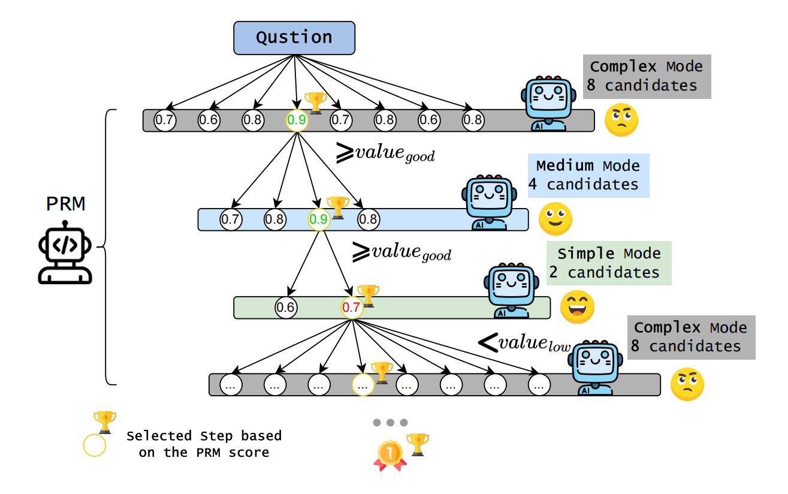
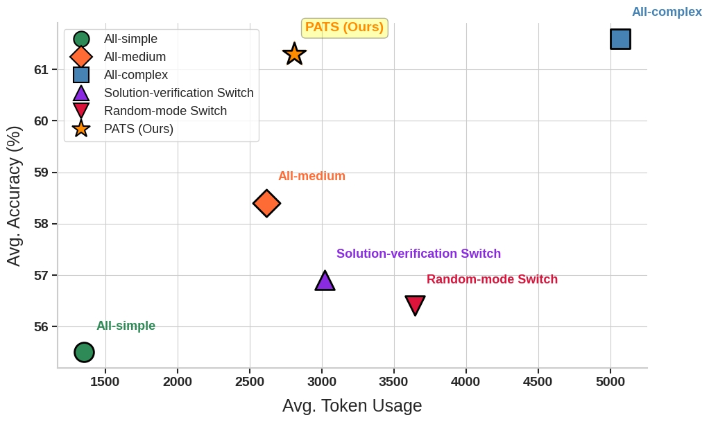
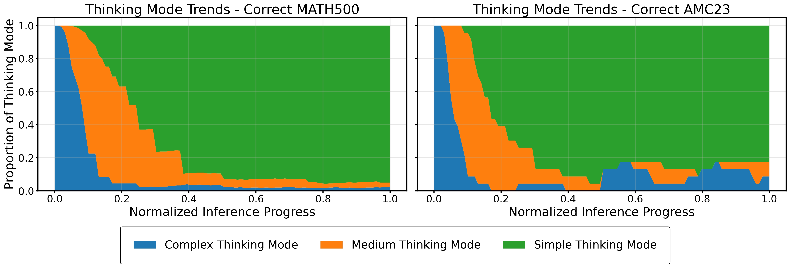

# PATS: Process-Level Adaptive Thinking Mode Switching

<p align="center">
  <a href="https://arxiv.org/abs/your-paper-id "> 📃 Paper</a> | 
  <a href="https://github.com/NJUNLP/PATS "> ⚙️ Code</a> 
</p>

<p align="center">
  
</p>

## Overview

Current LLMs apply a fixed reasoning strategy to all problems, ignoring variations in task and process difficulty, leading to an imbalance between accuracy and efficiency.

To address this, we propose **Process-Level Adaptive Thinking Mode Switching (PATS)**, a novel reasoning paradigm that dynamically adjusts the reasoning strategy at each step based on its difficulty. Built on Process Reward Models (PRMs) and Beam Search, PATS adaptively switches between simple, medium, and complex thinking modes, enabling fine-grained reasoning control. While maintaining accuracy, more computational resources are allocated to harder steps and fewer to easier ones. Our method alose integrates progressive mode switching and rollback for bad steps. 

Experiments across multiple math benchmarks show that PATS consistently achieves **high accuracy with moderate token usage**, providing a **strong balance between performance and efficiency**, offering valuable insights into efficient inference for LLMs.

### 🔑 Key Features
- 🔁 **Dynamic Mode Switching**: Adjust reasoning strategies based on the difficulty of the reasoning process.
- 🧠 **Step-Level Adaptation**: Novel process-level fine-grained adaptive reasoning paradigm.
- 📈 **Efficient Inference**: Strong accuracy-efficiency balance with insights for efficient LLM inference.
- 🧩 **Robust Generalization**: Compatible with diverse policy models and PRMs across tasks.


---

## 🏆 Experiment Results

### 🚀 **Performance Across Datasets**

We evaluate our method across multiple math reasoning datasets including **GSM8K, MATH500, AMC23, MinervaMath, and AIME24**.

<p align="center">
  
</p>

> **Conclusion:** PATS achieves effective and efficient reasoning with an excellent accuracy-efficiency balance.

### 📊 **Initial modes Comparison**

Performance of initial thinking modes across tasks of varying difficulty, with datasets categorized as easy (GSM8K, MATH500), medium (AMC23, MinervaMATH), and hard (AIME24) based on greedy accuracy.

| Setting             | GSM8K<br>Acc / Token | MATH500<br>Acc / Token | AMC23<br>Acc / Token | MinervaMATH<br>Acc / Token | AIME24<br>Acc / Token |
|---------------------|----------------------|-------------------------|----------------------|-----------------------------|-----------------------|
| PATS-first-simple   | 94.4 / 600.1         | 80.2 / 1582.0           | 62.5 / 2400.1        | 43.0 / 1648.4               | 16.7 / 3998.5         |
| PATS-first-medium   | 94.7 / 644.1         | 80.2 / 1687.8           | 65.0 / 3349.2        | 44.1 / 1633.9               | 16.7 / 5776.0         |
| ⭐ **PATS (Ours)** | 94.8 / 855.8          | 80.6 / 2067.7           | 65.0 / 3365.7        | 43.0 / 1929.9               | 23.3 / 5821.0         |

> **Conclusion:** Aligning the initial thinking mode with task difficulty leads to better performance.

### 📈 **Reasoning Across Task Difficulties**

We compare reasoning processes using MATH500 (easy) and AMC23 (hard) as representative tasks.

<p align="center">
  
</p>

> **Conclusion:** Harder reasoning tasks requires more computation for correct answers.

### 🧪 **Penalty on Bad Steps**

Compares three strategies: No Penalty, Infinite Penalty, and PATS (our one-time penalty method).

|**Setting** | **Avg. Accuracy ↑**| **Avg. Token Usage ↓** |
|--------|-----------------|--------------------|
| PATS-No-Penalty | 55.9% | 2362.9 |
| PATS-Infinite-Penalty | 60.0% | 4183.8 |
| ⭐ **PATS (Ours)**   | **61.3%** | **2808.0** |

> **Conclusion:** PATS best balances accuracy improvement and token cost, indicating that penalties are necessary but should be moderate.

---
## 🛠️ Usage

**For specific usage, please refer to `./code/examples/example.sh`.**

We set the temperature to **0.6** to balance candidate step diversity and generation quality. We set reward thresholds as follows: **$value_{good} = 0.85$**, **$value_{low} = 0.75$**, and **$value_{bad} = 0.4$**. The threshold setting is determined by the distribution of scoring preferences in the PRM and empirical configuration.


---

## 📌 Key Contributions

- Introduced a **dynamic thinking mode switching paradigm** that adapts reasoning complexity at the process level.
- Demonstrated superior performance with **lower computational cost** compared to static multi-candidate methods.
- Validated generalization across **multiple policy models and PRMs**.
- Released code, datasets, and trained models for reproducibility and further research.

---

## Citation

If you find this repository helpful, feel free to cite our paper:

```bibtex
@misc{2025pats,
  title={PATS: Process-Level Adaptive Thinking Mode Switching},
  author={Yi Wang and Junxiao Liu and Shimao Zhang and Jiajun Chen and Shujian Huang},
  year={2025},
  eprint={your-arxiv-id},
  archivePrefix={arXiv},
  primaryClass={cs.CL},
  url={https://arxiv.org/abs/your-arxiv-id }
}