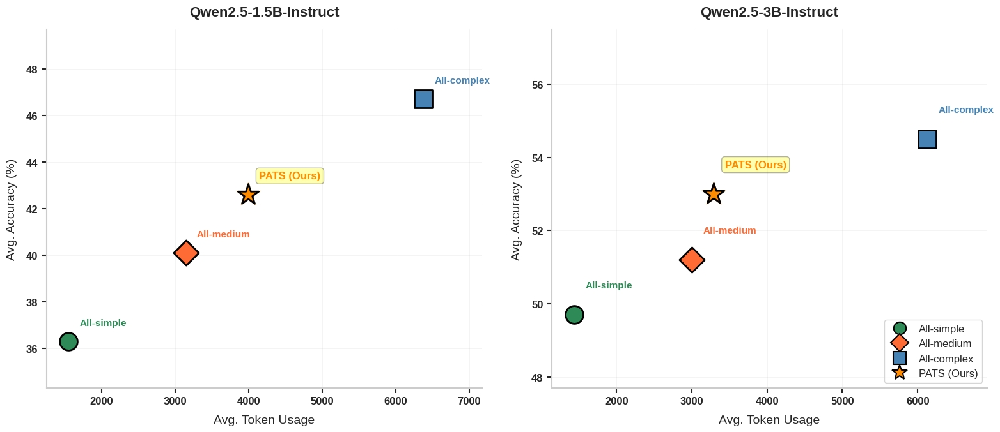
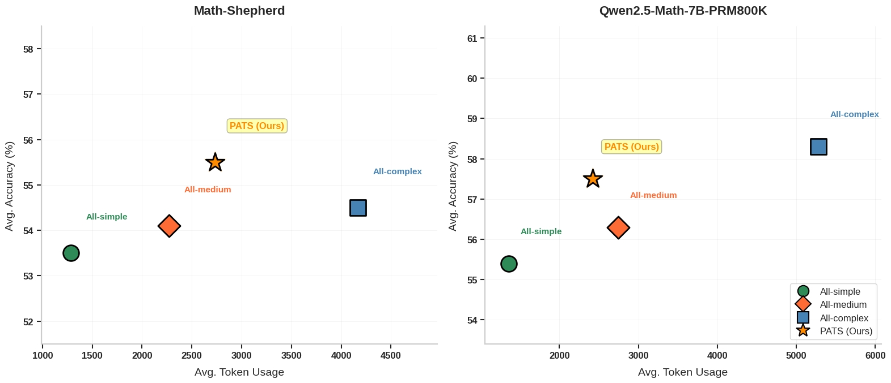

# PATS: Process-Level Adaptive Thinking Mode Switching

<p align="center">
  <a href="https://arxiv.org/abs/your-paper-id"> 📃 Paper</a> | 
  <a href="https://github.com/NJUNLP/PATS"> ⚙️ Code</a> 
</p>

<p align="center">
  
</p>

## Overview

Current LLMs apply a fixed reasoning strategy to all problems, ignoring variations in task and process difficulty, which leads to an imbalance between accuracy and efficiency.

To address this, we propose **Process-Level Adaptive Thinking Mode Switching (PATS)**, a novel reasoning paradigm that dynamically adjusts the reasoning strategy at each step based on its difficulty. Built on Process Reward Models (PRMs) and Beam Search, PATS adaptively switches between simple, medium, and complex thinking modes, enabling fine-grained reasoning control. While maintaining accuracy, it allocates more computational resources to harder steps and fewer to easier ones. Our method also integrates progressive mode switching and rollback for bad steps. 

Experiments across multiple math benchmarks show that PATS consistently achieves **high accuracy with moderate token usage**, providing a **strong balance between performance and efficiency**, and offering valuable insights into efficient inference for LLMs.

### 🔑 Key Features
- 🔁 **Dynamic Mode Switching**: Adjust reasoning strategies based on the difficulty of the reasoning process.
- 🧠 **Step-Level Adaptation**: A novel process-level fine-grained adaptive reasoning paradigm.
- 📈 **Efficient Inference**: Strong accuracy-efficiency balance with insights for efficient LLM inference.
- 🧩 **Robust Generalization**: Compatible with diverse policy models and PRMs across tasks.


## 🏆 Experiment Results

### 🚀 **Comparison with Baselines**

We evaluate our method across multiple math reasoning datasets including **GSM8K, MATH500, AMC23, MinervaMATH, and AIME24**, and show the average performance across these five datasets. The policy model is Qwen2.5-7B-Instruct, and the Process Reward Model is Qwen2.5-Math-PRM-7B.

<p align="center">
  
</p>

> **Conclusion:** Based on the average metrics, PATS achieves effective and efficient reasoning with an excellent accuracy-efficiency balance.

### 📊 **Initial Mode Performance**

Performance of initial thinking modes across tasks of varying difficulty, with the datasets categorized as easy (GSM8K, MATH500), medium (AMC23, MinervaMATH), and hard (AIME24) based on greedy accuracy.

| Setting             | GSM8K<br>Acc / Token | MATH500<br>Acc / Token | AMC23<br>Acc / Token | MinervaMATH<br>Acc / Token | AIME24<br>Acc / Token |
|---------------------|----------------------|-------------------------|----------------------|-----------------------------|-----------------------|
| PATS-first-simple   | 94.4 / 600.1         | 80.2 / 1582.0           | 62.5 / 2400.1        | 43.0 / 1648.4               | 16.7 / 3998.5         |
| PATS-first-medium   | 94.7 / 644.1         | 80.2 / 1687.8           | 65.0 / 3349.2        | 44.1 / 1633.9               | 16.7 / 5776.0         |
| ⭐ **PATS (Ours)** | 94.8 / 855.8          | 80.6 / 2067.7           | 65.0 / 3365.7        | 43.0 / 1929.9               | 23.3 / 5821.0         |

> **Conclusion:** More difficult tasks derive greater benefit from initiating reasoning with more complex thinking modes, which suggests that aligning the initial thinking mode with task difficulty leads to better performance.

### 📈 **Reasoning Across Task Difficulties**

We compare reasoning processes using MATH500 (easier) and AMC23 (harder) as representative tasks.

<p align="center">
  
</p>

> **Conclusion:** AMC23 shows a higher proportion of more complex thinking modes in the mid-to-late stages, suggesting that harder reasoning tasks require more computational resources for correct answers.

### 🧪 **Penalty on Bad Steps**

Compared three strategies for bad steps—No Penalty, Infinite Penalty, and PATS (one-time penalty)—based on the average metrics across five datasets.

|**Setting** | **Avg. Accuracy ↑**| **Avg. Token Usage ↓** |
|--------|-----------------|--------------------|
| PATS-No-Penalty | 55.9 | 2362.9 |
| PATS-Infinite-Penalty | 60.0| 4183.8 |
| ⭐ **PATS (Ours)**   | **61.3** | **2808.0** |

> **Conclusion:** PATS best balances accuracy improvement and token cost, indicating that penalties are necessary but should be moderate.

### 🔍 **Generalization Experiments**

We evaluate the generalization of PATS’s two core components: the policy model and the process reward model. Similarly, we show the average performance metrics across five datasets.

**Generalization of PATS across different policy models**, while keeping the Process Reward Model fixed as Qwen2.5-Math-PRM-7B.
<p align="center">
  
</p>

**Generalization of PATS across different Process Reward Models**, while keeping the policy model fixed as Qwen2.5-7B-Instruct.
<p align="center">
  
</p>

> **Conclusion:** PATS balances high accuracy with moderate token usage, showing robust generalization across diverse policy models and PRMs.


## 🛠️ Usage

**For specific usage, please refer to `./code/examples/example.sh`.**

We set the temperature to **0.6** to balance candidate step diversity and generation quality. We set reward thresholds as follows: **$value_{good} = 0.85$**, **$value_{low} = 0.75$**, and **$value_{bad} = 0.4$**. The threshold setting is determined by the distribution of scoring preferences in the PRM and empirical configuration.


## 📝 Citation

If you find this repository helpful, feel free to cite our paper:

```bibtex
@misc{wang2025patsprocessleveladaptivethinking,
      title={PATS: Process-Level Adaptive Thinking Mode Switching}, 
      author={Yi Wang and Junxiao Liu and Shimao Zhang and Jiajun Chen and Shujian Huang},
      year={2025},
      eprint={2505.19250},
      archivePrefix={arXiv},
      primaryClass={cs.CL},
      url={https://arxiv.org/abs/2505.19250}, 
}